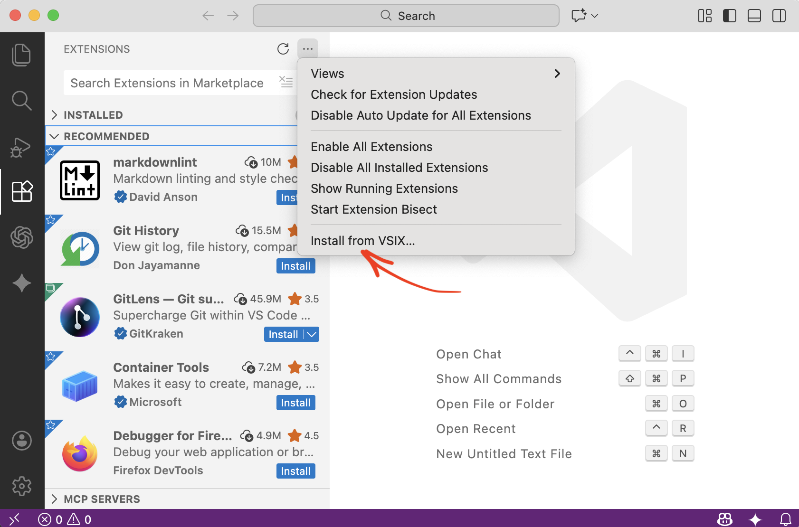
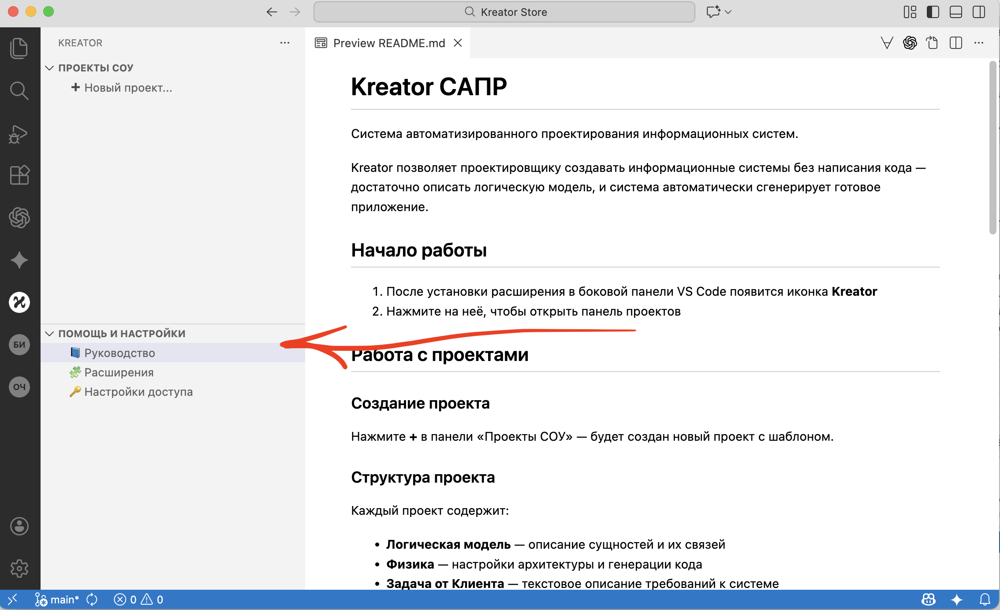

  <h1>Kreator CAD</h1>
  

    Система Автоматизированного Проектирования 
    для создания Систем Организационного Управления (СОУ)
  

  
   
  
  

    <a href="./kreator.vsix" class="btn-download" download>
      🛠 Скачать Среду Проектирования
    </a>
  

  
  

    Версия: v0.1 (Alpha) • Лицензия: Private
  

---

## ⚡️ Что такое Kreator?

**Kreator** — это инструмент для быстрой разработки строгих управленческих систем. Он позволяет описать логику организации (кто, что и как делает) и автоматически сгенерировать готовое рабочее место для сотрудников.

* **Фокус на логике:** Вы описываете смыслы, а не рисуете кнопки.
* **Pain-Driven Development:** Инструментарий выдает только то, что необходимо для снятия организационной боли.
* **Две коробочки:** Чёткое разделение среды разработки и среды исполнения.

> *"Мы не продаём софт. Мы передаём зафиксированный в инструменте способ деятельности."*

---

## 🚀 Установка

### Шаг 1. Платформа
Убедитесь, что у вас установлен **VS Code**.
[Скачать с code.visualstudio.com](https://code.visualstudio.com/)

### Шаг 2. Установка расширения
1. Скачайте файл **`kreator.vsix`** по кнопке выше.
2. Откройте VS Code.
3. Откройте **View → Extensions** (Вид → Расширения) или нажмите `Ctrl+Shift+X` / `Cmd+Shift+X`.
4. Нажмите **⋯** (три точки) в верхней части панели расширений.
5. Выберите **Install from VSIX...** (Установить из VSIX...) и укажите скачанный файл.

---

## 🏁 Начало работы

После установки расширения:

1. Найдите в боковой панели иконку **Κ** (греческая буква каппа).
2. Нажмите на неё — откроется панель Kreator.
3. Выберите **Руководство** для начала работы.

---

